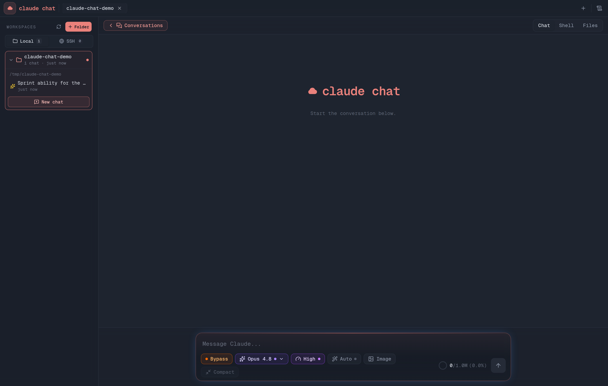
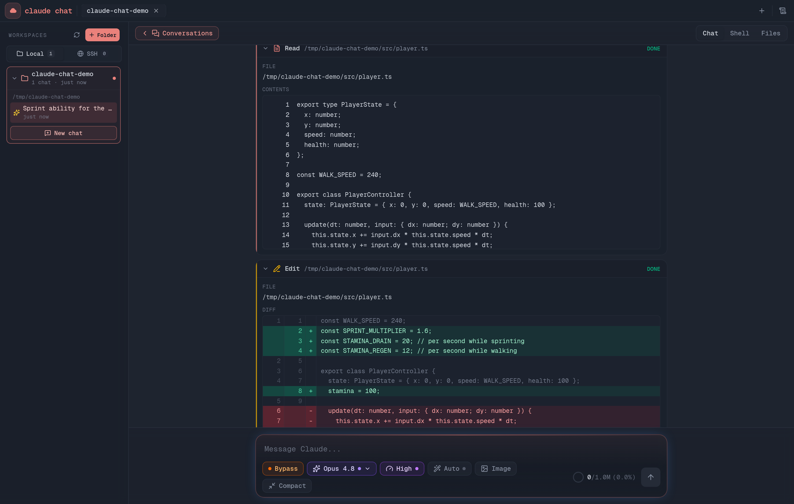
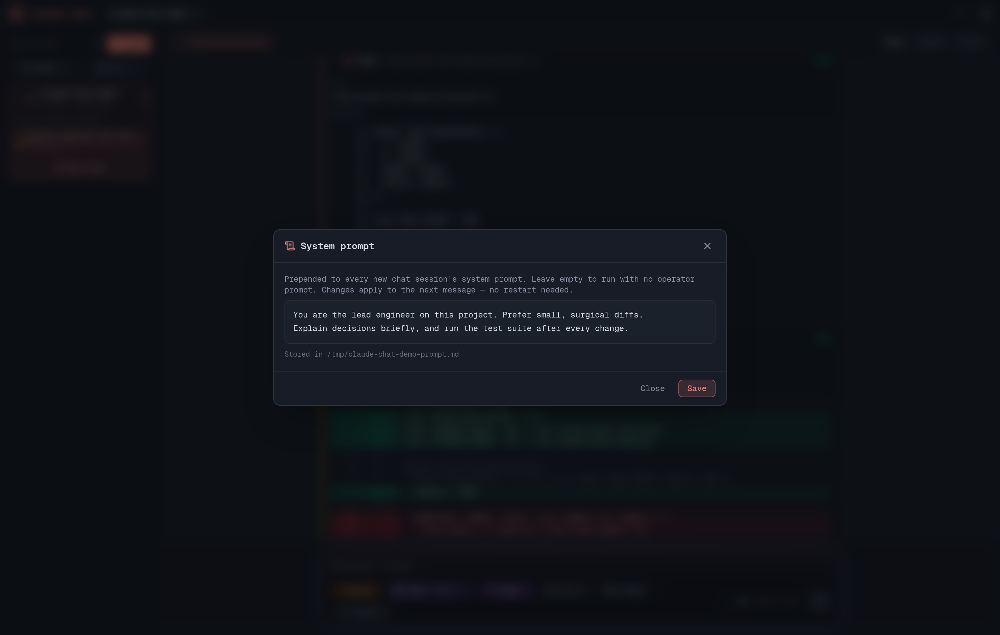

# claude chat

> **Status: BETA** — actively developed. Expect rough edges; see [Known bugs](#known-bugs--roadmap) below.

**claude chat** is a self-hosted web UI for the [Claude Agent SDK](https://docs.claude.com/en/api/agent-sdk/overview). It gives you the full agentic Claude Code experience — tool calls, thinking, file edits, shells — in your browser, against **local folders on your machine** or **remote machines over SSH**, with persistent conversations, live token accounting, and a built-in terminal and file browser.



---

## What it does

You pick a workspace (a local folder or an SSH path on a remote host), and chat with Claude about it. Claude runs with the full Claude Code toolset — `Bash`, `Read`, `Write`, `Edit`, `Glob`, `Grep`, `WebSearch`, `WebFetch`, `Task` (subagents), `TodoWrite`, and more — and every tool call streams into the chat as a rich, expandable card (diffs for edits, line-numbered output for reads, live output for shell commands).

Conversations are persisted in a local SQLite database and can be resumed at any time. The app also discovers existing Claude Code CLI sessions for a folder and lets you continue them.



---

## Getting started

### Requirements

- **Node.js 20+**
- The **Claude Code CLI** installed and authenticated (`claude` on your `PATH`, or point `CLAUDE_CLI_PATH` at the binary). The app drives the CLI through the Agent SDK, so your existing Claude subscription/login is what gets used.
- Linux or macOS (uses `node-pty` for the built-in terminal).

### Run it

```bash
npm install
npm run dev          # development, http://localhost:3000
```

Production:

```bash
npm run build
npm run start        # or: pm2 start ecosystem.config.cjs   (port 3002)
```

### Where data lives

| Thing | Location |
|---|---|
| Conversations + workspaces (SQLite) | `~/.claude-chat/claude-chat.db` |
| SSH credential encryption key | `~/.claude-chat/secrets.key` (mode 0600) |
| Optional system prompt | `system-prompt.local.md` (see below) |

DB path can be overridden with `CLAUDE_CHAT_DB_PATH`.

---

## The local system

The left panel lists your **local workspaces** — folders on the machine running the server. Add one with the folder picker, and every conversation you start is bound to that folder as Claude's working directory.

- Conversations are stored per-workspace and listed with titles and timestamps.
- Existing **Claude Code CLI sessions** for the same folder are discovered from `~/.claude/projects/` and shown alongside (badged `external`), so you can resume work you started in the terminal.
- Old messages page in lazily as you scroll up, so giant histories stay fast.

## The SSH system

claude chat can work on **remote machines** as first-class workspaces:

1. **Connect** — add a host (user, host, port) in the Connect SSH modal. Auth tries, in priority order: your SSH agent (`SSH_AUTH_SOCK`), every plausible key from `~/.ssh` (plus an explicit identity file if you give one), and finally a password if provided.
2. **Stored credentials** are encrypted at rest with AES-256-GCM; the key lives outside the database so a copy of the DB alone can't reveal passwords.
3. **Pick a remote folder** with the remote folder browser and it becomes a workspace with a `ssh://user@host:port/path` identity.

When you chat in an SSH workspace, Claude's filesystem and shell tools are **transparently swapped for remote equivalents**: an in-process MCP server exposes `Bash`, `Read`, `Write`, `Edit`, `Glob`, `Grep`, and `LS` that execute over the SSH connection (commands via exec, files via SFTP), while the matching built-in local tools are blocked. The remote tools are 1:1 mirrors of the built-ins — same parameters, same output format, and remote images come back as real image blocks so Claude can *see* screenshots on the server.

Conversations created in an SSH workspace are tagged `ssh` in the database and badged in the UI, and are kept out of your local workspace listings.

## The shell system

Every workspace has a built-in terminal (xterm.js):

- **Local workspaces** get a real PTY (`node-pty`) in the workspace folder.
- **SSH workspaces** get a live remote shell channel on the host.
- Output is buffered server-side in a ring, so reconnecting (or switching tabs) replays what you missed instead of showing a blank screen.

## The file system

The Files view is a workspace-agnostic file browser:

- Tree navigation of the whole workspace — local FS for local workspaces, SFTP for SSH ones.
- File preview with syntax-aware rendering.
- **Uploads**: pick any folder in the tree and upload files into it. For local workspaces the files are written straight to disk; for SSH workspaces they are streamed to the remote host **over SFTP**. There is intentionally no server-side size cap — your disk and your link are the limits.

---

## Chat features

### Model picker

Choose the model per conversation:

| Model | Thinking |
|---|---|
| Claude Fable 5 | adaptive (always on) |
| Claude Opus 4.8 *(default)* | adaptive (always on) |
| Claude Opus 4.7 | adaptive (always on) |
| Claude Sonnet 4.6 | adaptive (always on) |
| Claude Haiku 4.5 | extended (always on) |

### Thinking (effort) picker

Thinking is always on; what you control is the **effort** — how deep the model thinks: `Low → Medium → High → X-High → Max`. Your choice is remembered per model.

### Auto effort

Optional toggle: before your first message of a conversation is sent, a fast Sonnet classifier reads the request and **recommends an effort level with a one-line reason**. You accept, reject, or cancel — nothing is changed silently. Off by default (it costs one extra small round-trip).

### Permission modes (including Bypass)

A one-click cycler in the composer sets how much autonomy Claude gets, mirroring Claude Code's permission modes:

- **Default** — standard permission behavior.
- **Auto** — routine actions approved automatically.
- **Accept Edits** — file edits are pre-approved.
- **Bypass** — `bypassPermissions`: all permission checks skipped; Claude acts fully autonomously. Powerful — use it in workspaces you trust.

### Interactive questions

When Claude calls `AskUserQuestion`, the questions render as an interactive form above the composer — single/multi select, with a free-text "Other" for every question. Long question lists scroll inside the panel instead of pushing the UI off-screen.

### Token + usage meters

- A **context ring** next to the composer shows the live context-window footprint of the conversation (out of 1M tokens), updated per API call during agentic loops — including a breakdown of cached vs fresh tokens.
- A **plan usage meter** tracks your subscription's rate-limit windows (5-hour, 7-day, per-model) with reset countdowns.

### Compaction

Conversations can be compacted (manually, or automatically when the context fills up). A divider in the chat marks the boundary with before/after token counts.

### Message queueing mid-loop

Send a message while Claude is in the middle of a long tool-call loop and it lands in the chat at the right chronological point — injected into the live loop rather than waiting for the turn to end. Messages that can't be injected yet are queued visibly under the composer and can be removed before they send.

### Multiple instances

The tab bar supports several parallel chat instances over different workspaces. *(Beta: see known bugs.)*

---

## System prompt

**The app ships with no system prompt.** Out of the box, sessions run with only a small runtime environment block (workspace info).

The easiest way to set one: click the **scroll icon in the top bar** and type your standing instructions into the editor. Saved prompts apply from the next message on — no restart needed.

Under the hood the prompt lives in a plain file, resolved in this order:

1. The file pointed at by `CLAUDE_CHAT_SYSTEM_PROMPT_PATH`
2. `system-prompt.local.md` in the project root (gitignored — never committed)
3. `~/.claude-chat/system-prompt.md`

You can also edit that file directly; its contents are prepended to every new session's system prompt.



---

## Known bugs & roadmap

This is a **beta**. Known issues being worked on:

- **Unstable multi-instance usage** — running several chat tabs at once can misbehave (cross-talk, stuck streams). Treat multi-instance as experimental for now.
- **SSH conversation "adoption" by local workspaces** — if you have a conversation in an SSH workspace and then switch to a local folder, that conversation can get transferred/claimed by the local workspace. Known, fix planned.

## Upcoming features

Beyond bug fixes, here is where claude chat is headed:

- **No-code MCP connector** — add any MCP server to your workspaces from the UI: paste a command or URL, configure auth and env in a form, toggle it per conversation. No JSON files, no restarts.
- **3D AI model integration for game development** — first-class connectors for 3D generation models (Tripo and similar text/image-to-3D systems), so Claude can generate, fetch, and iterate on 3D assets directly inside a chat.
- **PBR generation models** — hook up material/texture generation models to produce full PBR sets (albedo, normal, roughness, metallic, AO) from prompts, ready to drop into a game project.
- **Direct Unreal Engine integration** — drive Unreal directly from the chat: import generated assets, manipulate the project, and let Claude work inside the engine the same way it works inside a codebase today.
- **Continued bug fixes & stabilization** — multi-instance hardening, SSH workspace isolation (the conversation-adoption bug above), and general reliability work, release by release.

Issues and PRs welcome.

---

## Tech stack

Next.js (App Router) · React 19 · Tailwind v4 · `@anthropic-ai/claude-agent-sdk` · better-sqlite3 · ssh2 · node-pty · xterm.js
