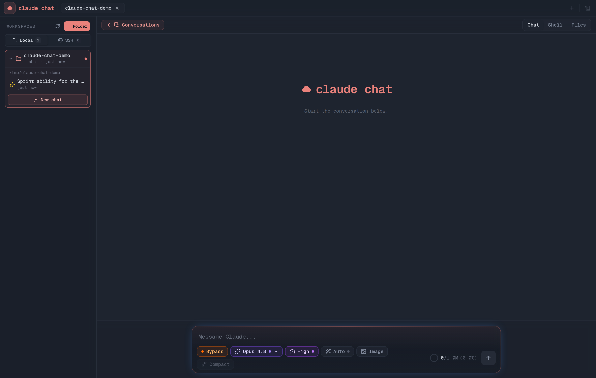
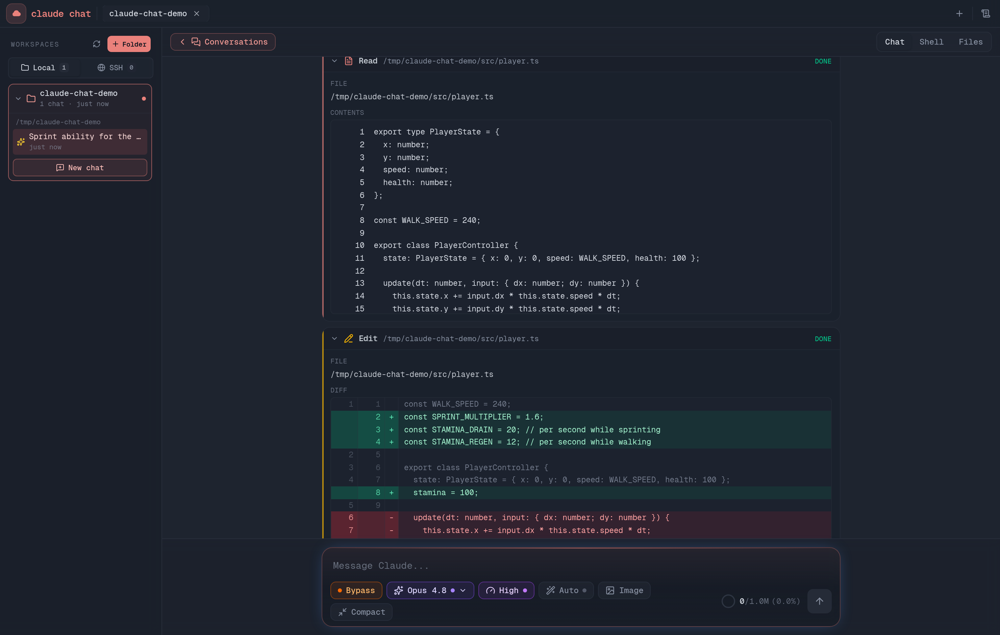
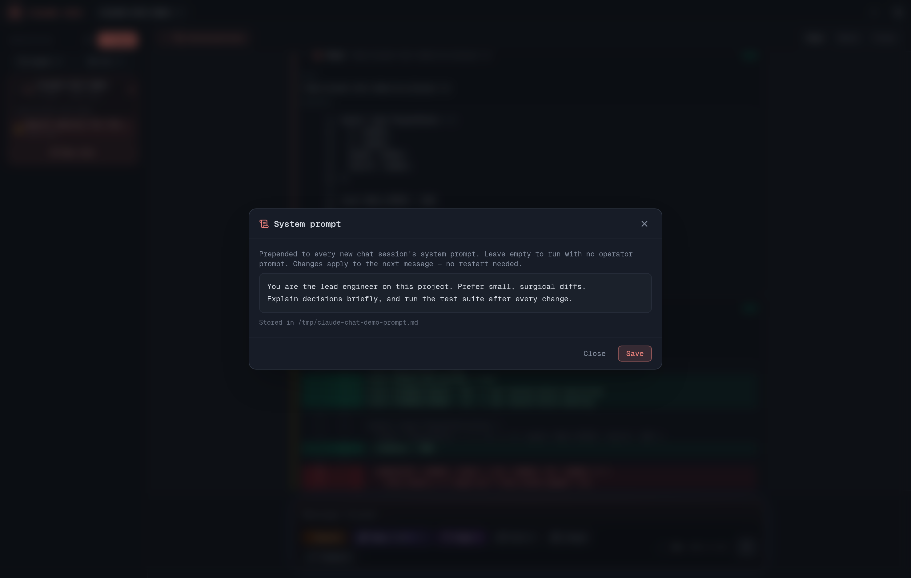

# claude chat

> **Status: BETA** — actively developed. Expect rough edges; see [Known bugs](#known-bugs--roadmap) below.

> ## ⚠️ Set up your system prompt first
>
> **claude chat ships with NO system prompt.** The system prompt this app was developed with has been deliberately **stripped from the public code** — out of the box, Claude runs with only a minimal runtime block and completely stock behavior.
>
> **You need to set up your own system prompt to tell Claude how to behave.** It takes 30 seconds: click the **scroll icon (📜) in the top bar**, write your standing instructions, and hit Save — it applies from your very next message. (Or drop a `system-prompt.local.md` file in the project root.) Details in [System prompt](#system-prompt).

**claude chat** is a self-hosted web UI for agentic coding. It gives you the full Claude Code experience — tool calls, thinking, file edits, shells — in your browser, against **local folders on your machine** or **remote machines over SSH**, with persistent conversations, live token accounting, a built-in terminal and file browser, voice dictation, and a no-code MCP connector.

It is not Claude-only. Two engines sit behind the chat — the [Claude Agent SDK](https://docs.claude.com/en/api/agent-sdk/overview) and [OpenCode](https://opencode.ai) — and between them the app serves Claude, DeepSeek, Kimi, GLM, and Qwen.



---

## What it does

You pick a workspace (a local folder or an SSH path on a remote host), and chat about it. The model runs with the full agentic toolset — `Bash`, `Read`, `Write`, `Edit`, `Glob`, `Grep`, `WebSearch`, `WebFetch`, `Task` (subagents), `TodoWrite`, any MCP servers you have attached, and more — and every tool call streams into the chat as a rich, expandable card (diffs for edits, line-numbered output for reads, live output for shell commands).

Conversations are persisted in a local SQLite database and can be resumed at any time. The app also discovers existing Claude Code CLI sessions for a folder and lets you continue them.



---

## Getting started

### Requirements

- **Node.js 20+**
- The **Claude Code CLI** installed and authenticated (`claude` on your `PATH`, or point `CLAUDE_CLI_PATH` at the binary). The Agent SDK backend drives the CLI, so your existing Claude subscription/login is what gets used.
- Linux or macOS (uses `node-pty` for the built-in terminal).
- Optional: API keys for any non-Claude providers you want ([below](#provider-api-keys)), and a Soniox key for [voice input](#voice-dictation).

### Run it

```bash
npm install
npm run dev          # development, http://localhost:3000
```

Production:

```bash
npm run build
npm run start        # scripts/start.sh — loads .env.local, brings up the tunnel, serves on $PORT
```

`npm run start` runs `scripts/start.sh` rather than `next start` directly, because there are two things the bare server does not do for you: **load `.env.local`** (see [Provider API keys](#provider-api-keys)) and **bring up remote access**. Use `npm run start:plain` if you want neither.

Under pm2: `pm2 start ecosystem.config.cjs` (port 3002).

Then open the app and **set your system prompt** (scroll icon, top bar) — the app ships without one, and the model behaves stock until you give it your own instructions.

### The password gate

**Everything is behind a password**, with no exception for loopback. That is deliberate: this app spawns shells, reads and writes the filesystem, and SSHes to other machines as the user running the server, so an unauthenticated request is a remote root shell. And a "trust localhost" shortcut would be worse than useless — `tailscale serve` terminates TLS and forwards to `127.0.0.1`, so tunnelled traffic is indistinguishable from genuinely local traffic at the socket level.

Set the password one of two ways:

```bash
# Either: a file beside the database (the reliable path)
mkdir -p ~/.claude-chat && printf 'your-password' > ~/.claude-chat/app-password
chmod 600 ~/.claude-chat/app-password

# Or: an environment variable actually exported into the server process
export APP_PASSWORD='your-password'
```

Sessions are **signed, not stored** — a restart does not log your devices out, and sessions last 30 days. The password's fingerprint is part of what gets signed, so **changing the password revokes every session**. Set `AUTH_SECRET` if you want sessions to survive moving the app to another machine.

### Provider API keys

`next start` does **not** load `.env.local` into the process environment. `scripts/start.sh` sources it before exec'ing the server, which is why `npm run start` goes through that script — otherwise the keys exist only when pm2 happens to have inherited them from an interactive shell, and after a reboot it has not (`pm2 startup` installs a launchd job, and launchd never reads your shell rc).

Put the keys for whichever providers you use in `.env.local` (gitignored):

| Provider | Variable | Base-URL override | Notes |
|---|---|---|---|
| Anthropic | *(CLI login)* | — | Uses your Claude subscription via the CLI. `ANTHROPIC_API_KEY` also works. |
| DeepSeek | `DEEPSEEK_API_KEY` | `DEEPSEEK_BASE_URL` | |
| OpenRouter | `OPENROUTER_API_KEY` | `OPENROUTER_BASE_URL` | Marketplace route to Kimi K3. |
| Kimi Code | `KIMI_API_KEY` | `KIMI_BASE_URL` | Kimi **Code subscription**. Not interchangeable with the key below. |
| Moonshot | `MOONSHOT_API_KEY` | `MOONSHOT_BASE_URL` | Moonshot's own **pay-as-you-go** API. CN mirror via the base-URL var. |
| Z.AI | `ZAI_API_KEY` | `ZAI_BASE_URL` | Billed against the GLM coding plan, not per token. |
| Qwen | `QWEN_API_KEY` | `QWEN_BASE_URL` | Model Studio **Token Plan** keys (`sk-sp-…`), *not* `DASHSCOPE_API_KEY`. |

A missing key fails with a message naming the exact variable to set, rather than a bare upstream 401.

### Where data lives

| Thing | Location |
|---|---|
| Conversations + workspaces (SQLite) | `~/.claude-chat/claude-chat.db` |
| App password | `~/.claude-chat/app-password` (mode 0600) |
| SSH credential encryption key | `~/.claude-chat/secrets.key` (mode 0600) |
| Soniox key for voice input | `~/.claude-chat/soniox-api-key` (mode 0600) |
| Optional system prompt | `system-prompt.local.md` (see below) |

DB path can be overridden with `CLAUDE_CHAT_DB_PATH`. Every secret above follows the same rule: an exported environment variable wins, and the file beside the database is the fallback that actually survives a reboot.

### Remote access

`npm run start` brings up a Tailscale tunnel by default so the app is reachable from your phone without a second command to forget. `npm run expose:tailnet` restricts it to your tailnet, `npm run expose:off` turns it off, and `CC_SKIP_EXPOSE=1` skips it entirely. See **[docs/remote-access.md](docs/remote-access.md)** for the full setup and the reasoning.

### Install as an app (PWA)

claude chat is a **Progressive Web App** — install it for a standalone window with its own icon, no extra runtime and no second browser engine (unlike Electron/Tauri, it reuses the browser you already have).

- **Chrome / Edge** — open the app and click the **install icon** in the address bar (or ⋮ → *Install claude chat*).
- **iOS Safari** — **Share → Add to Home Screen**.

Installing requires a secure context, so open the app at **`http://localhost:3002`** (localhost counts as secure even over plain HTTP). To install from another device — e.g. over Tailscale — serve it over **HTTPS** first; `tailscale serve` gives you a free certificate.

---

## The local system

The left panel lists your **local workspaces** — folders on the machine running the server. Add one with the folder picker, and every conversation you start is bound to that folder as the working directory.

- Conversations are stored per-workspace and listed with titles and timestamps.
- Existing **Claude Code CLI sessions** for the same folder are discovered from `~/.claude/projects/` and shown alongside (badged `external`), so you can resume work you started in the terminal.
- Old messages page in lazily as you scroll up, so giant histories stay fast.

## The SSH system

claude chat can work on **remote machines** as first-class workspaces:

1. **Connect** — add a host (user, host, port) in the Connect SSH modal. Auth tries, in priority order: your SSH agent (`SSH_AUTH_SOCK`), every plausible key from `~/.ssh` (plus an explicit identity file if you give one), and finally a password if provided. A key that already works is kept — reconnecting will not silently downgrade you to password auth.
2. **Stored credentials** are encrypted at rest with AES-256-GCM; the key lives outside the database so a copy of the DB alone can't reveal passwords.
3. **Pick a remote folder** with the remote folder browser and it becomes a workspace with a `ssh://user@host:port/path` identity.

When you chat in an SSH workspace, the filesystem and shell tools are **transparently swapped for remote equivalents**: an in-process MCP server exposes `Bash`, `Read`, `Write`, `Edit`, `Glob`, `Grep`, and `LS` that execute over the SSH connection (commands via exec, files via SFTP), while the matching built-in local tools are blocked. The remote tools are 1:1 mirrors of the built-ins — same parameters, same output format, and remote images come back as real image blocks so the model can *see* screenshots on the server.

**Cross-platform remotes.** The remote tools are **OS-aware**. The connection detects the remote's operating system once (via a `uname` probe) and adapts: against a POSIX host — Linux, macOS, or a Windows box whose SSH shell is WSL/Git-Bash — they use bash + GNU coreutils and `/`-rooted paths; against a **native Windows** host (OpenSSH with `cmd.exe`/PowerShell) they automatically switch to PowerShell equivalents (`Get-ChildItem`, `Select-String`, `New-Item`…) and Windows path handling (`C:\…` / `/C:/…`). Windows commands are run through `powershell -EncodedCommand`, so they're robust regardless of the remote's default shell. The system prompt says which platform it's on, so the model writes native commands from the first call. The file tools, file browser, uploads/downloads, and the built-in terminal work against Windows hosts too.

Conversations created in an SSH workspace are tagged `ssh` in the database and badged in the UI, and are kept out of your local workspace listings.

## The shell system

Every workspace has a built-in terminal (xterm.js):

- **Local workspaces** get a real PTY (`node-pty`) in the workspace folder.
- **SSH workspaces** get a live remote shell channel on the host.
- Output is buffered server-side in a ring, so reconnecting (or switching tabs) replays what you missed instead of showing a blank screen.

## The file system

The Files view is a workspace-agnostic file browser:

- Tree navigation of the whole workspace — local FS for local workspaces, SFTP for SSH ones.
- File preview with syntax-aware rendering.
- **Uploads**: pick any folder in the tree and upload files into it. For local workspaces the files are written straight to disk; for SSH workspaces they are streamed to the remote host **over SFTP**. There is intentionally no server-side size cap — your disk and your link are the limits.
- **Downloads**: every file row (and the preview header) has a download button. Local files stream from disk; **SSH files stream from the remote host over SFTP** straight to your browser — chunked end to end, so even huge remote files download without being buffered in server memory.
- **Folder downloads**: folder rows have a download button too. The folder is packed into a gzipped tar **on the fly** (`tar` runs locally for local workspaces, on the remote host for SSH ones) and streamed as a single `<folder>.tar.gz` — no temp files, no server-side buffering, no size cap.

## Moving a conversation

Any conversation can be **moved into another workspace** — local to local, local to remote, remote to local — with the folder button on its row. The destination list is the workspaces claude chat already knows, because a conversation is bound to a folder by its path alone. The button is disabled while a turn is still streaming.

- The underlying engine transcript moves with it, so history is preserved and the conversation resumes normally in its new home.
- **External CLI sessions can be moved too.** A session the CLI wrote directly has no database row; moving it adopts it into the database rather than dead-ending the button.
- Destinations are restricted to known workspaces on purpose: an arbitrary `ssh://` path would have to be invented as a plain local folder, with no way to tell whether it needs a password, a key, or an agent.

---

## Chat features

### Backend picker

Each conversation runs on one of two engines, chosen when it is created:

| Backend | What it is | Trade-off |
|---|---|---|
| **Claude Agent SDK** *(default)* | Spawns the Claude Code CLI | The only way to use a **Claude subscription**. Reaches other providers through their Anthropic-compatible endpoints. |
| **OpenCode** | Open-source harness via the Vercel AI SDK | Reaches DeepSeek, GLM, Kimi, and Qwen on their **native endpoints** — no compatibility shim. **Cannot run Claude models.** |

The choice is **frozen at creation** and there is no switch-backend operation. Each engine keeps its own session store under its own id format, so a conversation that changed engine mid-life would hand one engine an id the other minted — it would silently start a fresh session and continue with no memory of anything before the switch. Freezing the choice makes that impossible by construction.

### Model picker

Choose the model per conversation. The picker only offers models the conversation's backend can actually serve.

| Model | Provider | Context | Notes |
|---|---|---|---|
| Claude Fable 5 | Anthropic | 1M | Mythos-class flagship |
| Claude Opus 5 *(default)* | Anthropic | 1M | |
| Claude Sonnet 5 | Anthropic | 1M | Also the auto-effort classifier |
| DeepSeek V4 Pro | DeepSeek | 1M | Thinking always on, not configurable |
| DeepSeek V4 Flash | DeepSeek | 1M | ~⅓ the price of Pro |
| Kimi K3 | OpenRouter | 1M | Marketplace; pinned to `:nitro` routing |
| Kimi K3 (Code Plan) | Moonshot | 1M | Flat-rate Kimi Code subscription |
| Kimi K3 (Moonshot API) | Moonshot | 1M | First-party pay-as-you-go |
| GLM 5.3 | Z.AI | 1M | Coding-plan billing, no marketplace markup |
| Qwen 3.8 Max | Alibaba | 1M | Model Studio Token Plan; multimodal |

The three Kimi K3 entries are the same weights on three different **billing routes** — the subscription has usage windows that run out, OpenRouter's quality varies with whichever host it picks, and the first-party API is the one that always works at a predictable price.

Retired model ids are migrated rather than dropped, so a conversation pinned to an older tier keeps running on its successor instead of silently reverting to the default.

### Thinking (effort) picker

Thinking is always on; what you control is the **effort** — how deep the model thinks: `Low → Medium → High → X-High → Max`. Your choice is remembered per model. The ladder is an Anthropic parameter, so for providers that spell it differently it is omitted rather than sent under a name their endpoint ignores.

### Auto effort

Optional toggle: before your first message of a conversation is sent, a fast Sonnet classifier reads the request and **recommends an effort level with a one-line reason**. You accept, reject, or cancel — nothing is changed silently. Off by default (it costs one extra small round-trip).

### Permission modes (including Bypass)

A one-click cycler in the composer sets how much autonomy the model gets, mirroring Claude Code's permission modes:

- **Default** — standard permission behavior.
- **Auto** — routine actions approved automatically.
- **Accept Edits** — file edits are pre-approved.
- **Bypass** — `bypassPermissions`: all permission checks skipped; the model acts fully autonomously. Powerful — use it in workspaces you trust.

### Voice dictation

Tap the mic button in the composer and talk; words appear in the composer as you speak them, and tapping again stops the stream.

- Audio streams from your browser **straight to [Soniox](https://soniox.com)** over a WebSocket — it never passes through this server. `/api/voice/token` mints a **single-use key valid for 60 seconds**, so the long-lived key stays server-side and a leaked temporary key buys nothing but one expiring session.
- **Multilingual by design**: language identification is on with Romanian and English hinted, so a single stream follows you switching mid-sentence. Hints only weight the decision — all 60 supported languages still transcribe.
- Configure with `SONIOX_API_KEY`, or write the key to `~/.claude-chat/soniox-api-key`. Without it the mic button explains what to set.

### MCP connector

Attach any MCP server to a workspace from the UI — no JSON files, no restarts. The **plug button** on any folder row (local *and* remote) opens the manager.

- **Three transports**: local stdio, stdio **over SSH** (the server runs on the remote host), and HTTP.
- **Definitions are global, attachments are per folder** — define a server once, then toggle it on for the workspaces that should see it.
- **Probe before you trust it**: the manager can connect and list the server's real tools, so a broken command fails in the modal rather than mid-conversation.
- **Protocol-level proxying** — `tools/list` and `tools/call` are forwarded as JSON, so whatever the real server's schemas are, they cross untouched. Proxies connect lazily, so a dead entry fails its own handshake instead of taking down the turn.
- **Self-service**: the model gets an `mcp` tool of its own and can connect, attach, and detach servers mid-conversation — install one on the SSH host with the remote shell, then wire it into the harness. Changes take effect on the next message, and the tool results say so.

### Tool discipline

The system prompt ranks the tools: **purpose-built tool → built-in file tools → shell**. A shell can imitate almost every other tool, which is exactly what makes it the wrong default — it is always available, so it is always the path of least resistance, and taking it discards everything the specific tool knows.

The rule that matters most is that a fallback is scoped to **the single attempt that needed it**. Most tool failures are transient or argument-specific — the app wasn't running yet, a path was wrong — so "that tool didn't work" must never survive as a standing conclusion for the rest of the conversation. And a genuinely broken tool has to be called out loud, because silently routing around one hides the very fact you need in order to fix it.

### Interactive questions

When the model calls `AskUserQuestion`, the questions render as an interactive form above the composer — single/multi select, with a free-text "Other" for every question. Long question lists scroll inside the panel instead of pushing the UI off-screen.

### Token + usage meters

- A **context ring** next to the composer shows the live context-window footprint of the conversation, measured against that model's real window, and updated per API call during agentic loops — including a breakdown of cached vs fresh tokens.
- A **plan usage meter** tracks your subscription's rate-limit windows (5-hour, 7-day, per-model) with reset countdowns.

### Compaction

Conversations can be compacted (manually, or automatically when the context fills up). A divider in the chat marks the boundary with before/after token counts.

### Message queueing mid-loop

Send a message while the model is in the middle of a long tool-call loop and it lands in the chat at the right chronological point — injected into the live loop rather than waiting for the turn to end. Messages that can't be injected yet are queued visibly under the composer and can be removed before they send.

### Multiple instances

The tab bar supports several parallel chat instances over different workspaces. *(Beta: see known bugs.)*

### Per-conversation notebook

Each conversation gets its own private **notebook** that the model maintains for itself. It's exposed as a `notebook` tool, and its contents are injected into the system prompt every turn — so durable facts, constraints, decisions, and conclusions survive even after the surrounding messages fall out of the context window.

- **Self-directed**: the model is instructed to record things worth remembering on its own initiative, and to keep the notes current (it can revise or delete stale lines).
- **Line-based editing**: `view`, `append`, `insert`, `replace`, and `delete` over numbered lines, so edits are surgical rather than full rewrites.
- **Scoped + private**: notes belong to one conversation only — never shared across conversations. They persist in the local SQLite database alongside the conversation.
- **You can read and edit them**: every conversation in the left-hand workspace panel has a small notebook button (✎) — open it to see exactly what has been noted and edit it yourself. Your changes apply from that conversation's next message.

---

## System prompt

**The app ships with no system prompt.** Out of the box, sessions run with only a small runtime environment block (workspace info, platform, attached MCP servers, tool discipline).

The easiest way to set one: click the **scroll icon in the top bar** and type your standing instructions into the editor. Saved prompts apply from the next message on — no restart needed.

Under the hood the prompt lives in a plain file, resolved in this order:

1. The file pointed at by `CLAUDE_CHAT_SYSTEM_PROMPT_PATH`
2. `system-prompt.local.md` in the project root (gitignored — never committed)
3. `~/.claude-chat/system-prompt.md`

You can also edit that file directly; its contents are prepended to every new session's system prompt.



---

## Known bugs & roadmap

This is a **beta**. Known issues being worked on:

- **Unstable multi-instance usage** — running several chat tabs at once can misbehave (cross-talk, stuck streams). Treat multi-instance as experimental for now.
- **SSH conversation "adoption" by local workspaces** — if you have a conversation in an SSH workspace and then switch to a local folder, that conversation can get transferred/claimed by the local workspace. Known, fix planned.

## Upcoming features

Beyond bug fixes, here is where claude chat is headed:

- **3D AI model integration for game development** — first-class connectors for 3D generation models (Tripo and similar text/image-to-3D systems), so the model can generate, fetch, and iterate on 3D assets directly inside a chat.
- **PBR generation models** — hook up material/texture generation models to produce full PBR sets (albedo, normal, roughness, metallic, AO) from prompts, ready to drop into a game project.
- **Direct Unreal Engine integration** — drive Unreal from the chat: import generated assets, manipulate the project, and work inside the engine the same way the model works inside a codebase today.
- **Continued bug fixes & stabilization** — multi-instance hardening, SSH workspace isolation (the conversation-adoption bug above), and general reliability work, release by release.

Issues and PRs welcome.

---

## Tech stack

Next.js 16 (App Router) · React 19 · Tailwind v4 · `@anthropic-ai/claude-agent-sdk` · `@opencode-ai/sdk` · Model Context Protocol · better-sqlite3 · ssh2 · node-pty · xterm.js · Soniox
